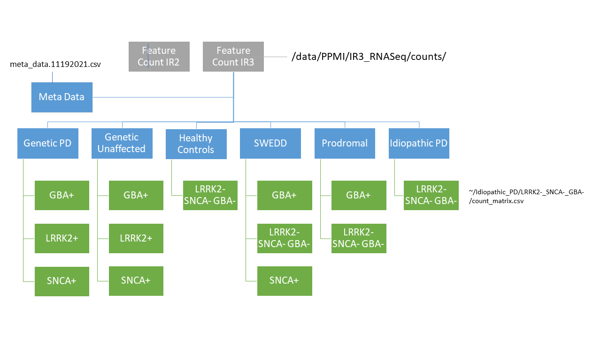

# Readme for PPMI Parkinson Gene Expression Project

## Phase 1 - Differential Gene Expression (GXD)
Looking to replicate the case-control results from [PPMI RNA-Seq Whole Genome Paper](https://www.nature.com/articles/s43587-021-00088-6)

### R-Code
#### paper_replication.R
1. Performs GXD using Limma R package
2. Perfroms experiment identical to the published paper linked above
3. Visualizes results as volcano plot and exports results to csv

#### case_control_DESeq.R
1. Performs GXD using Limma R package
2. Perfroms experiment identical to the published paper linked above
3. Visualizes results as volcano plot and exports results to csv

#### VariancePartition.R
1. Uses variancePartition package to identify sources of variation in gene expression data
2. Visualizes results

### Python-Code
#### Subsetting_Data_By_Cohort_Month.py
Note : Needs to be updated
1. Subsets raw count matrices into relative sub-folders as per below image 
